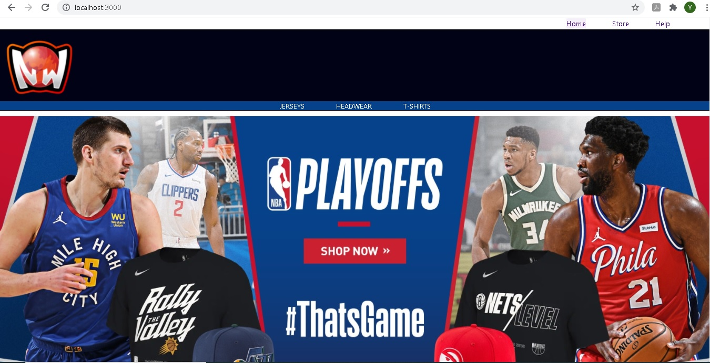

# LebronStore by Yamila Belén Grosso :hibiscus:

Este proyecto es mi primer trabajo con React, fue realizado en el curso de React de Coderhouse. 

Es una ecommerce que vende ropa deportiva puntualmente de nba :basketball:.

# Se utilizaron las siguientes Librerias:

:small_red_triangle_down:[Firebase](www.firebase.google.com) como base de datos.

:small_red_triangle_down:[Lottie](https://lottiefiles.com) para las animaciones.

:small_red_triangle_down:[React router](https://reactrouter.com) para las rutas de navegación.

:small_red_triangle_down:[Sweat Alert](https://sweetalert.js.org/guides/) para los alert.

# Para poder ver mi proyecto podes descargarlo y utilizar en la consola :desktop_computer:

### "npm install"

### "npm run start"

# Un avance del Home

